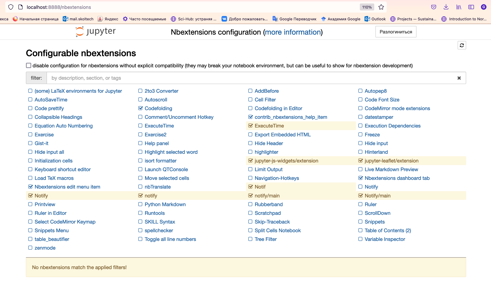

## Пакет для установки плагинов в Jupyter
====

Репозиторий:  [jupyter_contrib_nbextensions](https://github.com/ipython-contrib/jupyter_contrib_nbextensions)

## Как установить пакет и добавить плагины? 

`pip install jupyter_contrib_nbextensions`

Установка css и js

`jupyter contrib nbextension install --user`

`pip install jupyter_nbextensions_configurator`

`jupyter nbextensions_configurator enable --user`

При новом запуске Jupyter у вас появистя вкладка `nbextensions` в меню Jupyter

Список полезных плагинов:

* Ruler — отображает красным границу в 80 символов в строке. Этот плагин нужно поставить обязательно, чтобы не расстраивать проверяющих тем, что при конвертации в pdf у вас опять что-то не влезло в одну строку.
* Codefolding, Codefolding in editor — незаменимый плагин, который позволяет сворачивать код для лучшей читаемости.
* ExecuteTime — автоматически запоминает, когда ячейка начала выполняться и сколько времени это заняло.
* Notify — посылает push-уведомление в браузере, когда ячейка закончила выполняться. Если она отрабатывала достаточно долго.
* Move selected cells — позволяет одновременно перемещать выделенные ячейки вверх или вниз.

Список всех плагинов [тут](https://jupyter-contrib-nbextensions.readthedocs.io/en/latest/nbextensions.html)